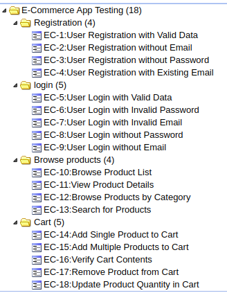
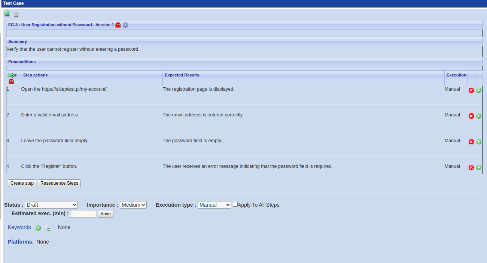

# Project 1: Manual Testing

## Description
This project involves manual testing of the e-commerce website [https://skleptest.pl/](https://skleptest.pl/). The tests focus on critical user functionalities such as registration, login, product browsing, and shopping cart functionalities.

## Test Plan

### Description
The objective of this project is to verify the functionality of the e-commerce website [https://skleptest.pl/](https://skleptest.pl/). The tests will focus on critical user functionalities such as registration, login, product browsing, and the purchasing process. The testing environment includes Ubuntu operating system with Google Chrome as the browser. The types of tests to be conducted include functional tests, usability tests, and regression tests. The criteria for test completion is 100% execution of all test cases.

### Scope of Testing

1. **Registration**: Ensuring that new users can register successfully with all required information.
2. **Login**: Verifying that registered users can log in and access their accounts.
3. **Product Browsing**: Checking that users can browse products, view product details, and filter/search for specific items.
4. **Shopping cart functionality**: Verify that users can add items, update quantities, view the cart from any page, remove items.

### Testing Environment

- **Operating System**: Ubuntu
- **Browser**: Google Chrome

### Types of Tests

1. **Functional Tests**: To verify that each feature works according to the requirements.
2. **Usability Tests**: To ensure the website is user-friendly and navigation is intuitive.

### Test Schedule

There is no specific time frame for the tests, they will be conducted continuously until all test cases are executed and all critical issues are resolved.

### Resources

- **Test Engineer**: Responsible for creating and executing test cases.
- **Tools**: TestLink for test management, Jira for defect tracking.

### Entry Criteria

- Test environment is set up and ready.
- Test cases are reviewed and approved.
- Access to the website [https://skleptest.pl/](https://skleptest.pl/) is available.

### Exit Criteria

- All test cases are executed.
- All critical and major defects are fixed and re-tested.
- Test summary report is prepared and reviewed.

### Risk and Mitigation

- **Risk**: Delays in test execution due to server downtime.
  - **Mitigation**: Ensure backup testing environment is available.
- **Risk**: Incomplete test coverage.
  - **Mitigation**: Regular review and update of test cases to cover all critical functionalities.

### Test Deliverables

- Test Plan
- Test Cases
- Defect Reports
- Test Summary Report

## Test Cases
- [Registration Test Cases](./tests/TestCases_Registration.md)
- [Login Test Cases](./tests/TestCases_Login.md)
- [Product Browsing Test Cases](./tests/TestCases_ProductBrowsing.md)
- [Shopping Cart Test Cases](./tests/TestCases_Cart.md)

## Test Reports

The following test reports have been generated and are available in the `reports` directory:

- [Test Plan Report](./reports/TestLink-raport.pdf): This report provides an overview of the test plan, including the scope of testing, test cases executed, and their results.
- [Test Result Matrix](./reports/TestLink-Matrix.pdf): This report provides a detailed matrix of test results, showing the execution status of each test case.
- [Test Summary Report](./reports/TestReport.md): This markdown file provides a summary of the testing activities and outcomes.

## Summary and Recommendations

Based on the results of the testing, the following observations and recommendations are made:

- A total of 18 test cases were executed, with 10 passing, 6 failing, and 2 blocked.
- Critical and major bugs were identified, particularly affecting the user registration, product browsing, and shopping cart functionalities.
- It is recommended to address the high-priority and critical issues identified during testing before proceeding to production.
- After fixes are implemented, a round of regression testing should be conducted to ensure no new issues have been introduced.

We recommend close collaboration between the testing and development teams to address the identified issues promptly and efficiently.

## Screenshots

### TestLink Test Cases List

### TestLink Test Case Details

